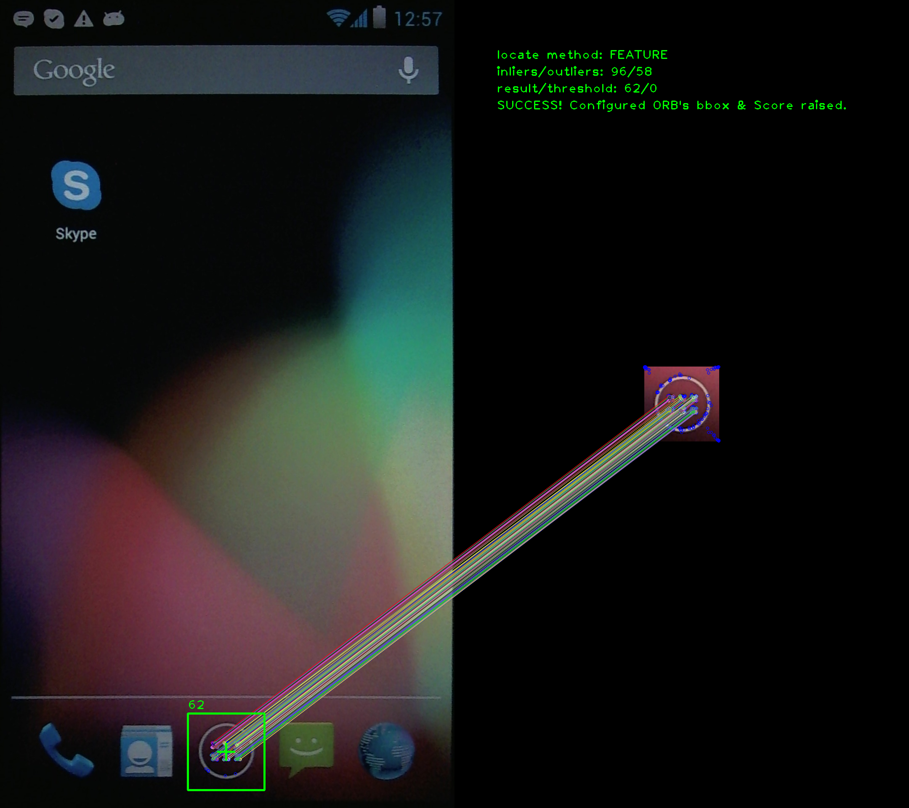

***************
Image location
***************

Location means searching for some template image (icon) in the image that is bigger
in size than the template.

Let's take we have ``homescreen`` screenshot:

.. figure::  img/homescreen.jpg
   :align:   center
   :scale: 30

   Screenshot image (1920x1080)

We want to locate icon ``appgrid`` in it:

   Icon to be located.

As a result (using FEATURE method) we get:

   Result of locating icon ``appgrid`` in the screenshot ``homescreen``.

Location methods
================

There are several location methods supported by Matcher library. Location method
is chosen based on ``method`` field in the :class:`matcher_types.MatchQuery`.

FEATURE
-------

The process of a feature-based object detection can be briefly divided into three phases:

1. Keypoints (features) detection → yields keypoints,
2. Keypoints description-extraction → yields descriptors,
3. Descriptors matching → yields matches.

Keypoints detection and description-extraction depends on detector and descriptor parameters.

Feature matching is done by ORB (Oriented BRIEF and Rotated FAST) keypoint detector and descriptor extractor, described in [RRKB11]_. The algorithm uses FAST in pyramids to detect stable keypoints, selects the strongest features using FAST or Harris response, finds their orientation using first-order moments and computes the descriptors using BRIEF (where the coordinates of random point pairs (or k-tuples) are rotated according to the measured orientation).

Matcher library contains several feature deteciton phases (see Feature::phases) that
are executed in a chain until one of them yields positive match or the end of list
is reached. That list is defined in the Matcher constructor.

.. [RRKB11] Ethan Rublee, Vincent Rabaud, Kurt Konolige, Gary R. Bradski: ORB: An efficient alternative to SIFT or SURF. ICCV 2011: 2564-2571.

MATCHTEMPLATE
-------------

Template matching method is based on sliding window approach. Actual
template patch is matched against an input image by sliding the patch over the input
image using ``square difference`` matching method.

SOBEL
-----

It is the edge detection method. At first image is preprocessed with Sobel operator,
which leaves only strongly distinct edges. At last correlation-based template matching
is performed on such a image.

OCR
---

OCR stands for Optical Character Recognition. Matcher library uses the tesseract
library in its core with support of OpenCV for image preprocessing.

Tesseract is probably the most accurate open source OCR engine available. It can
convert images to text in over 60 languages.

Matches filtering
=================

There are several filtering techniques, using which we can suppress number of outliers and
overall locating accuracy and verification result.
The following techniques are used by Matcher library:

* Thresholding
* Ratio test
* Cross-checking
* Double verification
* Planar location validation (only for locate)

The information about the aforementioned methods have been gathered below.

Thresholding
------------

Taking k=2 best matches for each descriptor from a query set with train descriptors, we can
filter out matches with absolute distance difference less than some certain threshold (minimum
nearest- neigbour distance threshold).
The method suppresses outliers significantly, although it decreases also the number of inliers
which can affect location of the small objects with a small number of keypoints. Therefore it is only
suitable for reference image verification, and for image location the threshold should be set to 0
(i.e. all the matches are valid).

Ratio test
----------
In this method we take the distance ratio between k=2 best matches for each descriptor from
a query set with train descriptors. We can filter out matches with a ratio above certain threshold
(maximum nearest-neighbour distance ratio).
Alike thresholding this method also suppresses outliers significantly, and also slightly
decreases number of inliers which can affect the location of the small objects with small number of
keypoints. Therefore it is presumably only suitable for reference image verification, and for image
location the ratio should be set to 1 (i.e. all the matches are valid).

Cross-checking
--------------
The principle of this method is the fact that calling knnMatch(A,B) is not the same as calling
knnMatch(B,A). In order to explain that, let’s assume for the sake of simplicity that k=1, so that for
each queried descriptor, the algorithm will only find 1 correspondence. Two data sets have been
randomly picked (green and red dots in the Figure 1).

.. figure::  img/crosscheck.jpg
   :align:   center

   Cross-check matching technique.

In the first plot, the greens are in the query data-set, meaning that for each green point, we try
to find the closest red point (each arrow represents a correspondence). In the second plot, the query
and the train data-sets has been swapped. The final result is plotted in the last picture, which shows
that only the bi-directional matches have been conserved. As we can see, the output of cross-check
matching is much better than each single knnMatch() since only the strongest correspondence have
been kept.

Double verification
-------------------

Another way of suppressing outliers and therefore yielding higher results (inliers-to-all-
matches ratio) is a double verification. After finding location of a template image, we
set a region of interest (ROI) on the currently processed image and verify that ROI against template
image again. Therefore we match features that we are only interested in.

Match validation
================

In order to filter out false positive results, several validation checks have been applied.

Geometry validation
-------------------

In this particular instantiation, we apply the RANSAC algorithm to the estimation of the
homography registering two images of the same scene.
The homography is an 8-parameter model arising in two situations when using a pinhole camera: the scene is planar (a painting, a facade, etc.) or a viewpoint location is fixed, e.g. a pure rotation around the optical centre.
When the homography is found, it is used to stitch the images in the coordinate frame of the second
image and build a panorama. The point correspondences between images are computed by one of
the feature detector.

The RANSAC algorithm (Random Sample Consensus) is a robust method to estimate
parameters of a model fitting the data, in presence of outliers among the measurement data. Its
random nature is due only to complexity considerations. In other words, randomization gives better
and faster results. It iteratively extracts a random sample, of minimal size sufficient to estimate the
parameters, out of all data. At each such a trial, the number of inliers (data that fits the model within
an acceptable error threshold) is counted. In the end, the set of parameters maximizing the number
of inliers is applied.

The parameter to be tuned in this method is a RANSAC reprojection threshold, which states
for a maximum allowed reprojection error to treat a point pair as an inlier.

According to OpenCV documentation, if measurements are performed in pixels, it usually makes sense to set this parameter somewhere in the range of 1 to 10.

Aspect ratio check
------------------
The result bounding box is checked whether its aspect ratio (width/hight) corresponds to
the one of input icon/template image. Some certain offset is allowed and defined in
matcher_consts.hpp (matcher::AROFFSET)

Bounding box size check
-----------------------

This method does not affect number of inliers nor outliers, but rather analyzes the coordinates
of the located template in the scene. The goal of this method is to drop any further analysis of the
final result (inliers-to-all-matches ratio), which is very unreliable way of deciding whether object has
been found or not.

The main assumption in this approach is that we allow only certain change in scale, i.e. the
size of the object in scene (currently processed image) differs from the original template image size
only by a certain offset. In this case, the best way to validate template image location is to compare
its size with the located bounding box. Due to the fact that homography can fail in the case of small
number of matches, it is advisable to use at least 30% size offset, i.e. if located objects width or
height exceeds the original template size by ±30% then it is assumed that template image has not
been found in the scene.
