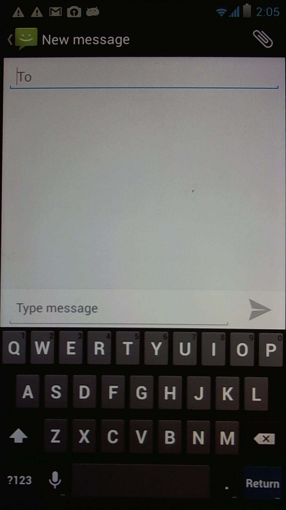
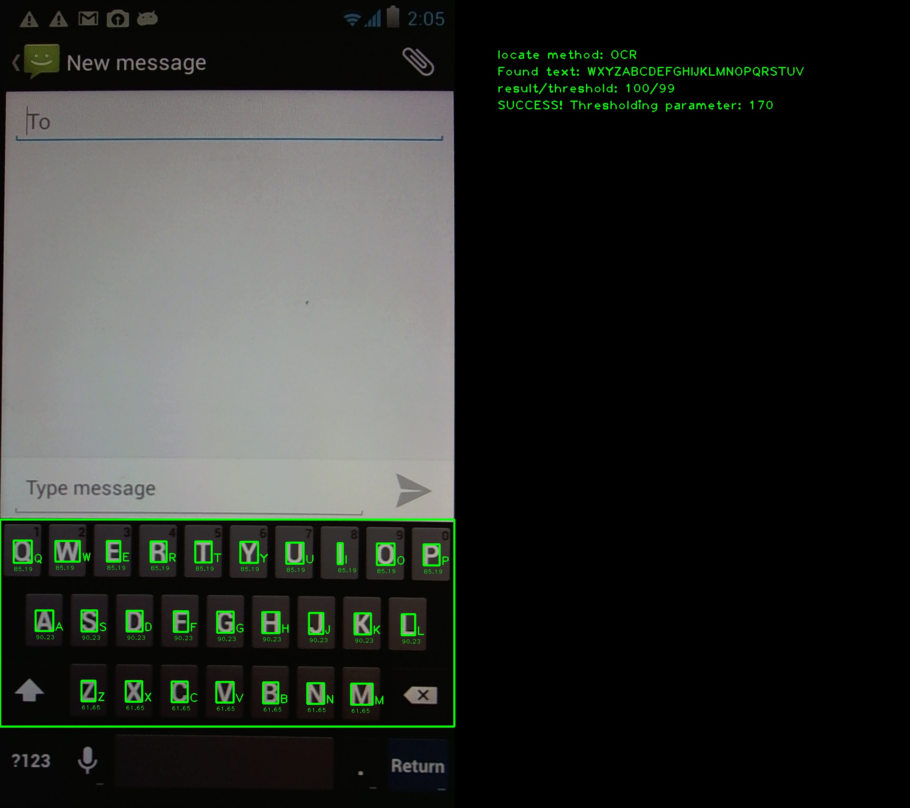

**************************
Virtual keyboard detection
**************************

Keyboard location refers to the situation when we are interested in locating
letters, digits or special characters in a single image at once, i.e. without
peforming location with OCR in a loop.

Let's say we want to find virtual keyboard characters (QWERTYUIOPASDFGHJKLZXCVBNM)
in a view:

   Screenshot image (1920x1080)

Using OCR locating method, the C++ code would look like this:

.. code-block:: c

    ...
    std::string chars = "QWERTYUIOPASDFGHJKLZXCVBNM";
    for (int i = 0; i < chars.length(); i++) {
        MatchResult *mresult = new MatchResult();
        MatchQuery mquery;
        mquery.icon = strdup(chars[i].c_str());
        mquery.method = LocateMethod::OCR;
        cv::Ptr<cv::Mat> resimg = matcher->match(image, mquery, mresult);
        ...
        // process single result
    }

Instead, we can do this in a single call:

.. code-block:: c

    ...
    std::string chars = "QWERTYUIOPASDFGHJKLZXCVBNM";
    MatchResult *mresult = new MatchResult(chars.length());
    MatchQuery mquery;
    mquery.icon = strdup(chars.c_str());
    cv::Ptr<cv::Mat> resimg = matcher->locatecharacters(image, mquery, mresult);

It is not only simpler notation, but also much faster. The result image ``resimg``
looks like that:

   Result image of locatecharacters().

Below each letter, the confidence of tesseract OCR engine is printed.