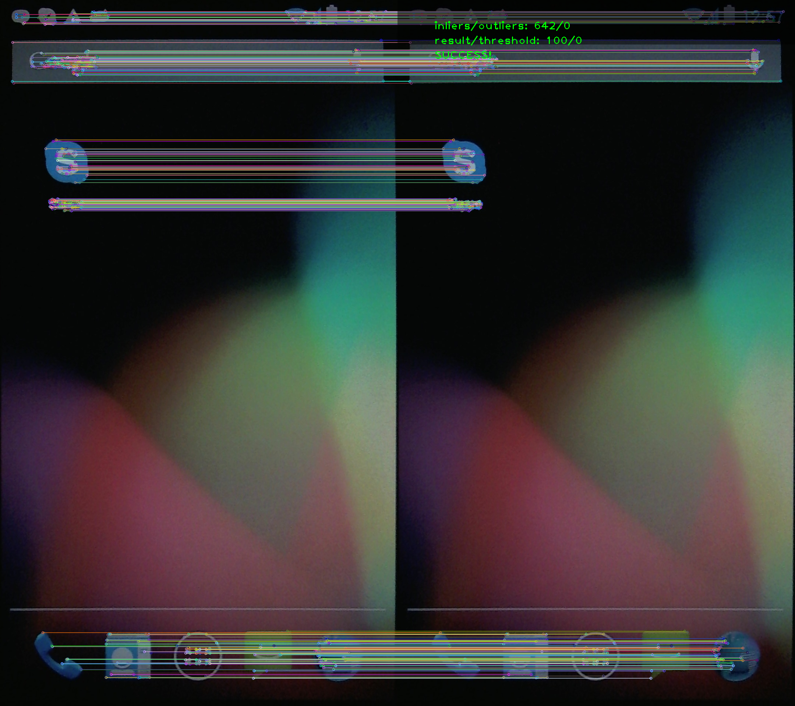

******************************
Image comparison (verification)
******************************

Verification is used in order to compare two images and find similarities between them.
The measure of similarity is based on feature matching, and it is inliers-to-all-ratio.

Example of successful verification is depicted below:

   Result of verification of screenshot ``homescreen``.

Feature matching is based on ORB (Oriented BRIEF and Rotated FAST) keypoint detector and descriptor extractor, described in [RRKB11]_. The algorithm uses FAST in pyramids to detect stable keypoints, selects the strongest features using FAST or Harris response, finds their orientation using first-order moments and computes the descriptors using BRIEF (where the coordinates of random point pairs (or k-tuples) are rotated according to the measured orientation).

Matcher library contains several feature deteciton phases (see Feature::phases).
However only the DEFAULT one is used for verification.

In principle verification is used for comparison of images of the same size, but it will
also work for the case when images have different size.

.. [RRKB11] Ethan Rublee, Vincent Rabaud, Kurt Konolige, Gary R. Bradski: ORB: An efficient alternative to SIFT or SURF. ICCV 2011: 2564-2571.

